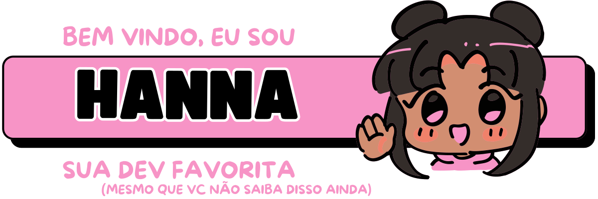
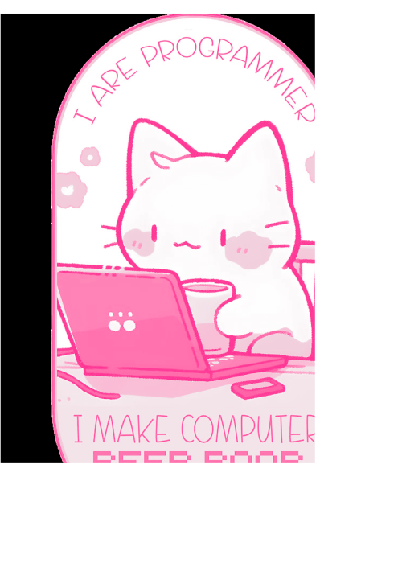

# - 🎀 Sobre mim:

🎓 Tenho 21 anos e sou estudante de <strong>Engenharia da Computação na UTFPR – Apucarana</strong>. Sou apaixonada por <strong>desenvolvimento front-end</strong>, interfaces bonitas e tudo que envolve <strong>design com propósito</strong>.

💻 Gosto de criar experiências que sejam <strong>funcionais, acessíveis e com personalidade</strong> — da lógica ao layout. Tenho conhecimento em <strong>HTML, CSS, React.js, Figma, C, C++ e Python</strong>, e estou sempre explorando novas tecnologias que expandam minha visão e minhas habilidades.

🌐 Acredito na força da <strong>colaboração</strong>, da <strong>comunicação clara</strong> e em projetos que realmente importam — especialmente os que <strong>abrem espaço pra mais mulheres na tecnologia</strong>. Por isso, faço parte do projeto <strong>Codificadoras</strong>, que promove ações para incentivar a participação feminina na área tech com muita representatividade e impacto. 💜

🎯 Também atuo na <strong>Therion</strong>, a empresa júnior de Engenharia da Computação da UTFPR. Lá, integro o time de <strong>marketing</strong>, levando nossa essência <strong>"rosa choque por resultados"</strong> pra dentro e fora da universidade — unindo criatividade, tecnologia e impacto social. 🩷

🚀 No fim das contas, quero usar o que sei (e o que ainda vou aprender) pra <strong>criar, inovar e transformar realidades</strong> através da tecnologia.

 ────────────୨ৎ────────────

<em> 𐔌՞. .՞𐦯 (mais) Alguns fatos divertidos sobre mim ִֶָ. ..𓂃 ࣪ ִֶָ🪽་༘࿐ ⋆. 𐙚 ˚ </em>

🌍 Sonho em trabalhar de qualquer lugar do mundo, criar projetos com alma e <strong>viver daquilo que me empolga</strong>.

🍕 Sou a amiga que sabe cozinhar e, apesar de todo mundo gostar, eu normalmente não gosto da minha comida.

🦎 Quando criança, tentei domesticar uma lagartixa. O nome dela era Jorge.

🎮 Tenho uma paixão absurda por jogos com narrativa densa, e meu jogo favorito do momento é <strong>The Witcher</strong>.

📚 Amo histórias que misturam filosofia, sociedade e fantasia.

🐺 <strong>Spice and Wolf</strong> é meu comfort anime/livro da vida. <strong>É SIM O MELHOR ROMANCE JÁ FEITO</strong>.

📸 Coleciono memórias — digo, fotos. Sou apaixonada por fotografia e por registrar momentos espontâneos.

🎧 Meu gosto musical vai de <strong>punk feminista</strong> tipo Bikini Kill até <strong>indie</strong>, passando por um <strong>metal pesadão</strong> e chegando num <strong>pop bem chiclete</strong>.

🖍️ Amo desenhar e colorir. Quem sabe em breve melhoro minhas pixelarts e crio um joguinho 2D?

🧠 Meus neurônios funcionam melhor depois das 23h. Antes disso, opero em modo “carregando...”.

🕹️ Amo jogos com escolhas morais, dilemas pesados e personagens quebrados emocionalmente. Sim, estou falando de você, Geralt.

📖 Tenho planos secretos (nem tão secretos) de escrever um livro ou criar um jogo autoral um dia.

🦊 Se eu fosse um personagem de fantasia, seria algo entre uma fada caótica, uma maga rebelde e uma vendedora de poções duvidosas na taverna.

  
  

 ────────────୨ৎ────────────

# - ☁️ Minhas Ferramentas e Linguagens

  
  
  
  
  
  
  

  
  
  
  

 
   
   

 ────────────୨ৎ────────────

  

Obrigada por visitar meu perfil! 💜
Fico muito feliz em compartilhar um pouquinho da minha trajetória por aqui.

Se você curte tecnologia com propósito, design que conversa com o usuário e projetos que buscam fazer a diferença, então estamos na mesma frequência! 🌈
Sinta-se à vontade pra explorar meus repositórios, trocar uma ideia ou me chamar pra colaborar em algo incrível. ✨

<strong>Vamos construir coisas legais juntas(os)?</strong> 🚀

