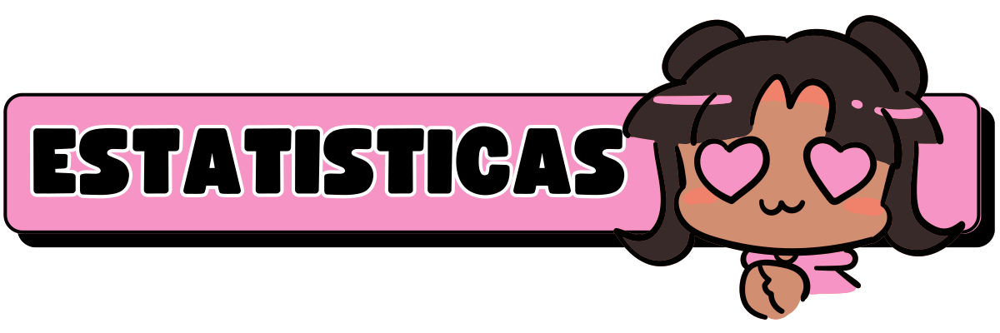

  
  

  
  
  
  
  
  
  

  
  
  
  

  
  

 ────────────୨ৎ────────────

# - ☁️ Minhas Ferramentas e Linguagens

  
  
  
  
  
  
  

  
  
  
  

 
   
   

 ────────────୨ৎ────────────

  

Obrigada por visitar meu perfil! 💜
Fico muito feliz em compartilhar um pouquinho da minha trajetória por aqui.

Se você curte tecnologia com propósito, design que conversa com o usuário e projetos que buscam fazer a diferença, então estamos na mesma frequência! 🌈
Sinta-se à vontade pra explorar meus repositórios, trocar uma ideia ou me chamar pra colaborar em algo incrível. ✨

<strong>Vamos construir coisas legais juntas(os)?</strong> 🚀

# - 🎀 Sobre:

 ────────────୨ৎ────────────

