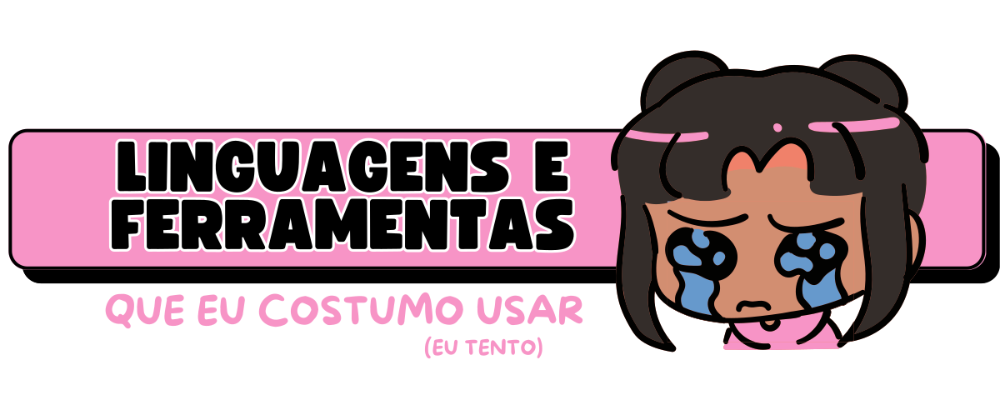

# - ☁️ Sobre mim:

🎓 Tenho 21 anos e sou estudante de <strong>Engenharia da Computação na UTFPR – Apucarana</strong>. Sou apaixonada por <strong>desenvolvimento front-end</strong>, interfaces bonitas e tudo que envolve <strong>design com propósito</strong>.

💻 Gosto de criar experiências que sejam <strong>funcionais, acessíveis e com personalidade</strong> — da lógica ao layout. Tenho conhecimento em <strong>HTML, CSS, React.js, Figma, C, C++ e Python</strong>, e estou sempre explorando novas tecnologias que expandam minha visão e minhas habilidades.

🌐 Acredito na força da <strong>colaboração</strong>, da <strong>comunicação clara</strong> e em projetos que realmente importam — especialmente os que <strong>abrem espaço pra mais mulheres na tecnologia</strong>. Por isso, faço parte do projeto <strong>Codificadoras</strong>, que promove ações para incentivar a participação feminina na área tech com muita representatividade e impacto. 💜

🎯 Também atuo na <strong>Therion</strong>, a empresa júnior de Engenharia da Computação da UTFPR. Lá, integro o time de <strong>marketing</strong>, levando nossa essência <strong>"rosa choque por resultados"</strong> pra dentro e fora da universidade — unindo criatividade, tecnologia e impacto social. 🩷

🚀 No fim das contas, quero usar o que sei (e o que ainda vou aprender) pra <strong>criar, inovar e transformar realidades</strong> através da tecnologia.

<em>🎮 (mais) Alguns fatos divertidos sobre mim</em>

  

  🌍 Sonho em trabalhar de qualquer lugar do mundo, criar projetos com alma e <strong>viver daquilo que me empolga</strong>.

  

# - 📊 Minhas estatísticas 

  
  

# -  📬 Onde me encontrar

 
   
   

  

  Obrigada por visitar meu perfil!💜

