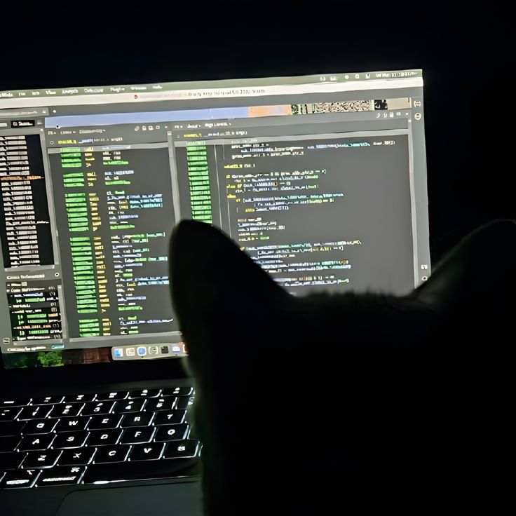

  
  

  
    

      
      
      
      
    

      
      
      
      
    

       
       
    

 

 
  ────────────୨ৎ──────────── 

<em> 𐔌՞. .՞𐦯 Sobre  ִֶָ. ..𓂃 ࣪ ִֶָ🪽་༘࿐ ⋆. 𐙚 ˚ </em>

 Estudante de Engenharia da Computação (UTFPR, 5º) • Dev em formação (Python, C/C++, MySQL, HTML/CSS) • Foco em UX/UI & HCI • Diretora de Marketing na Therion EJ — aberta a colaborações e oportunidades de estágio.
 

